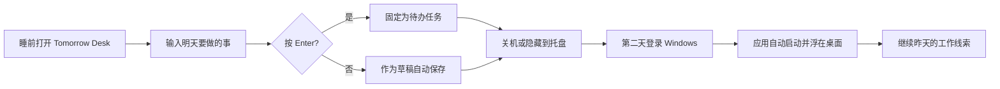

<div align="center">
  <h1>Tomorrow Desk</h1>
  <p><strong>请睡前的你给明天的自己规划待做任务</strong></p>

  <p>
    <a href="https://www.electronjs.org/"></a>
    <a href="https://www.microsoft.com/windows"></a>
    <a href="https://nodejs.org/"></a>
    <a href="#-开发与验证"></a>
    <a href="#-核心能力"></a>
  </p>
</div>

Tomorrow Desk 是一个极简 Windows 桌面待办应用：睡前把第二天要做的事情写进去，第二天登录 Windows 后，它会自动启动并把待办事项浮在桌面上。

它不想变成一个复杂项目管理系统，只解决一个具体问题：**关机之后，不要把昨天做到哪忘掉。**

[一键上手](#-小白一键上手) · [核心能力](#-核心能力) · [如何使用](#-如何使用) · [开发与打包](#-开发与验证) · [隐私与安全](#-隐私与安全)

---

## 核心能力

| 能力 | 说明 |
|---|---|
| 🌅 **开机即见** | 支持 Windows 登录后自动启动，打开后直接显示上次保存的待办内容 |
| 📌 **桌面悬浮** | 默认置顶，可通过 `Top` 按钮开关，适合做早晨第一眼提醒 |
| 💾 **本地自动保存** | 输入内容保存在本机 Electron user data 目录，不依赖网络和账号 |
| ✅ **分条待办** | 在输入框写事项后按 `Enter` 固定成一条任务，显示在输入框下方 |
| ↩️ **多行输入** | 输入框内换行使用 `Shift + Enter`，避免和固定任务冲突 |
| 🧹 **单条删除** | 每条任务右侧都有删除按钮，不必一次清空全部内容 |
| 🗑️ **一键清空** | `清空` 会清除当前输入和任务列表，并自动把光标放回输入框 |
| ✨ **黑金默认主题** | 默认黑金配色，顶栏 `Theme` 可切换 Ocean、Forest、Violet 等主题 |
| 🪟 **托盘常驻** | 关闭窗口时隐藏到系统托盘，托盘菜单支持 Show、Archive、Quit |
| 📦 **Windows 打包** | 支持生成安装包、便携版和 `win-unpacked` 免安装目录 |

> [!TIP]
> 想实现“开机后立刻看到待办事项”，请保持右上角 `Login` 和 `Top` 都处于高亮状态。

---

## 工作流程



### 默认行为

| 项目 | 默认配置 |
|---|---|
| 平台 | Windows desktop |
| 运行时 | Electron |
| 主题 | 黑金 `Black Gold` |
| 开机启动 | 默认开启，可用 `Login` 切换 |
| 窗口置顶 | 默认开启，可用 `Top` 切换 |
| 保存方式 | 本地自动保存 |
| 关闭按钮 | 隐藏到系统托盘，不直接退出 |
| 清空按钮 | 清空当前页面并聚焦输入框 |

---

## 小白一键上手

不熟悉 Electron、Node.js 或 Git 也没关系。把下面整段提示词发给具有终端权限的 Codex / Claude Code / Cursor Agent，让 Agent 自动完成安装、验证和启动。

<details>
<summary>点击展开：复制给 Agent 的一键上手提示词</summary>

```text
请帮我完整部署并运行 GitHub 仓库 https://github.com/zifangchen/tomorrow-desk。

要求：
1. 检查 Git、Node.js 20+、npm 是否可用；缺失时请告诉我需要安装什么。
2. 克隆仓库：
   git clone https://github.com/zifangchen/tomorrow-desk.git
   cd tomorrow-desk
3. 安装依赖：
   npm install
4. 运行测试：
   npm test
   必须确认所有测试通过。
5. 启动应用：
   npm start
6. 帮我确认主窗口是否能打开，右上角是否有 Top、Login、Theme、最小化和关闭按钮。
7. 告诉我如何保持 Login 和 Top 开启，以便下次 Windows 登录后第一时间看到待办事项。
8. 如果我要生成安装包，请运行：
   npm run dist:win
   并告诉我安装包、便携版和 win-unpacked exe 分别在哪里。
```

</details>

> [!IMPORTANT]
> 开机启动需要由 Windows 和 Electron 在本机注册，建议优先使用安装版日常使用。便携版也能运行，但不同 Windows 环境下开机启动稳定性可能不如安装版。

---

## 安装与运行

### 1. 克隆项目

```bash
git clone https://github.com/zifangchen/tomorrow-desk.git
cd tomorrow-desk
```

### 2. 安装依赖

```bash
npm install
```

### 3. 本地启动

```bash
npm start
```

### 4. 运行测试

```bash
npm test
```

### 5. 打包 Windows 应用

```bash
npm run dist:win
```

打包后常用产物：

| 产物 | 用途 |
|---|---|
| `dist/Tomorrow Desk Setup 0.1.0.exe` | Windows 安装包，推荐日常使用 |
| `dist/Tomorrow Desk 0.1.0.exe` | 便携版，可直接运行 |
| `dist/win-unpacked/Tomorrow Desk.exe` | 免安装解包目录中的主程序 |

---

## 如何使用

### 输入待办

- 在主输入框输入待完成事项。
- 按 `Enter`：把当前输入固定成一条待办，显示到输入框下方。
- 按 `Shift + Enter`：在输入框内换行。
- 输入框内容会自动保存；即使还没按 `Enter`，也会作为草稿恢复。

### 管理任务

| 操作 | 结果 |
|---|---|
| 点击单条任务右侧的 `×` | 只删除这一条任务 |
| 点击 `清空` | 清空输入框和全部任务，并自动聚焦输入框 |
| 托盘菜单 `Archive` | 归档当前内容后清空页面 |

### 顶栏按钮

| 按钮 | 用途 |
|---|---|
| `Top` | 切换窗口是否置顶 |
| `Login` | 切换是否开机启动 |
| `Theme` | 循环切换 Black Gold、Ocean、Forest、Violet 主题 |
| `−` | 最小化窗口 |
| `×` | 隐藏到系统托盘，保存后不退出程序 |

---

## 如何实现开机后立刻看到待办事项

推荐设置：

1. 使用 `dist/Tomorrow Desk Setup 0.1.0.exe` 安装应用。
2. 打开 Tomorrow Desk。
3. 确认右上角 `Login` 高亮：表示登录 Windows 后自动启动。
4. 确认右上角 `Top` 高亮：表示窗口保持置顶。
5. 睡前写下明天要做的事。
6. 关机或重启电脑。
7. 第二天登录 Windows 后，Tomorrow Desk 会自动打开并显示昨天保存的事项。

如果没有自动显示：

- 手动打开 Tomorrow Desk，再确认 `Login` 是否高亮。
- 在 Windows 启动应用设置中确认 Tomorrow Desk 没有被禁用。
- 优先使用安装版，而不是临时解压目录里的 exe。

---

## 项目结构

```text
tomorrow-desk/
├── docs/
│   └── USER_GUIDE.md
├── scripts/
│   └── create-icon.js
├── src/
│   ├── main/
│   │   ├── index.js
│   │   ├── preferences.js
│   │   ├── shell.js
│   │   └── storage.js
│   ├── renderer/
│   │   ├── index.html
│   │   ├── renderer.js
│   │   └── styles.css
│   └── preload.js
├── test/
├── package.json
└── README.md
```

---

## 开发与验证

常用命令：

```bash
npm install
npm test
npm start
npm run dist:win
```

当前测试覆盖：

- 本地 note 读写、归档和失败保护
- preferences 读取、保存、损坏 JSON 回退
- preload IPC 暴露
- renderer 输入、清空、单条删除、主题切换
- 窗口启动顺序和托盘相关逻辑
- UI 静态结构与关键样式约束
- Windows 打包配置和图标生成

发布前建议至少执行：

```bash
npm test
npm audit --audit-level=high
npm run dist:win
```

---

## 隐私与安全

- 待办事项保存在本机，不上传到网络。
- 仓库不包含用户数据、token、账号密码或本地 note 内容。
- `node_modules/`、`dist/`、`build/`、运行时数据和工作区文件不会提交。
- 如果你在真实使用中写了私人事项，请不要把 Electron user data 目录提交到 GitHub。

---

## 贡献

欢迎提交 Issue 或 Pull Request。适合改进的方向：

- 更细的主题配置
- 更稳定的 Windows 启动行为提示
- 更丰富但仍克制的任务交互
- 安装包图标和视觉细节优化
- macOS / Linux 适配

---

## License

本项目尚未声明开源许可证。公开仓库中的代码默认仅用于查看、学习和个人使用；如需复用或分发，请先补充明确许可证。

**如果 Tomorrow Desk 帮你找回了第二天早上的工作线索，欢迎点一个 Star。**
